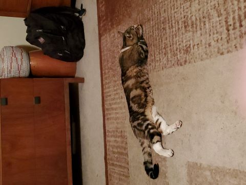

# Philip Garcia's (*Mostly*) Daily Schedule

## Mornings
### Wake-up Around 6am to 8 am
1. Make breakfast to start the day (Maybe make some **coffee** whenever I have time)
2. Check on pets to see if they need more food or any medication to start their day
3. Check emails to see if there is anything important to do for school or other necessary tasks.

---

## Afternoons
### Mandatory Duties
- Check to see if I need to do any grocery shopping 
- Work on whatever **assignments/projects** that can be done with the time I have.
- Handle chores around the house to get them out of the way.

---

## Evenings

My Evening Activities consist of the following:
- Making dinner *with* the family 
- Talk *with* the family about their day (My folks **REALLY** want to make sure I spend enough time with them)
- Play Video Games if I have free time to do so
Keep in mind, this is what I normally do **BEFORE** going to bed (Hopefully no later than *Midnight*)

---

## Author's Note

For some who might be curious a bit about what games I play and what system(s) I use, I usually play video games on a gaming PC or my Nintendo Switch (**Mostly** single player RPGs, but I have been getting into Monster Hunter games lately. So I might branch out into multiplayer games a little more.)

Also, here's a picture of one of the family pets. Enjoy!

